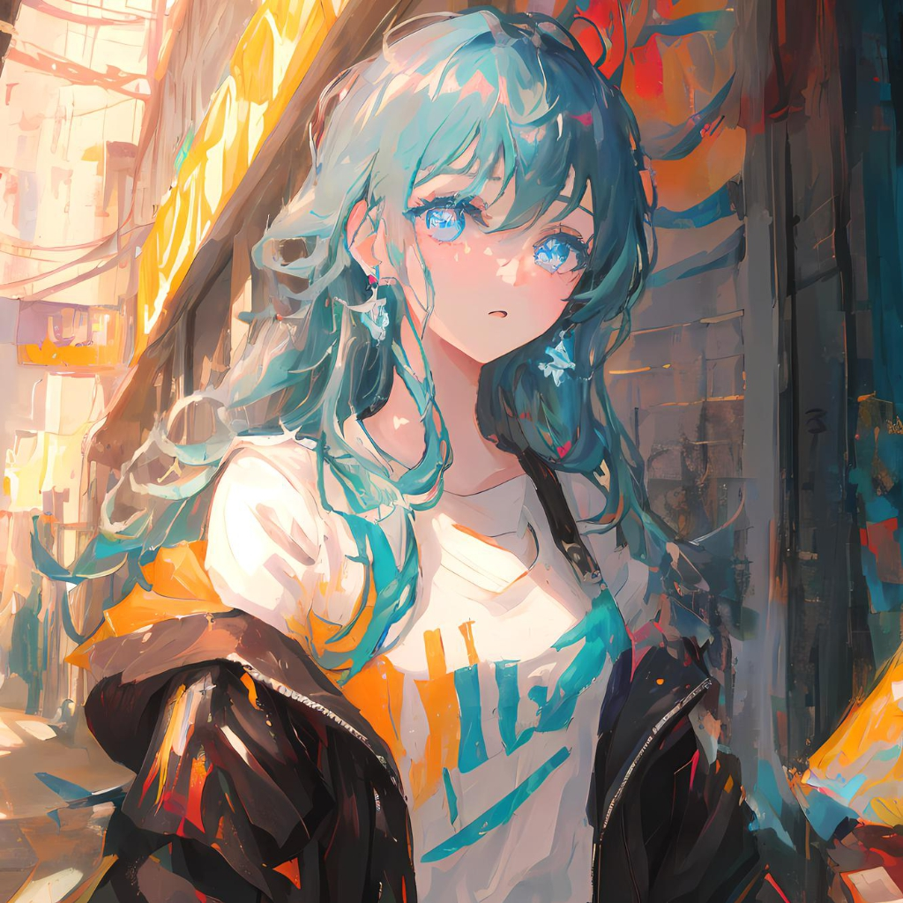

  

<h1 align="center">Hi, I'm Water.Shen!</h1>
<h1 align="center">Welcome to my GitHub profile~ OwO</h1>

  <strong><a href="https://www.cnblogs.com/sjava">博客园</a></strong>

🤔 I'm currently working on ShenZhen.

<!--
**edisonlee55/edisonlee55** is a ✨ _special_ ✨ repository because its `README.md` (this file) appears on your GitHub profile.

Here are some ideas to get you started:

- 🔭 I’m currently working on ...
- 🌱 I’m currently learning ...
- 👯 I’m looking to collaborate on ...
- 🤔 I’m looking for help with ...
- 💬 Ask me about ...
- 📫 How to reach me: ...
- 😄 Pronouns: ...
- ⚡ Fun fact: ...
-->
